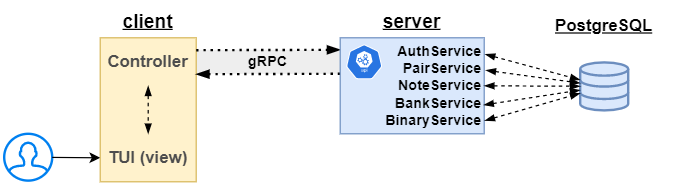
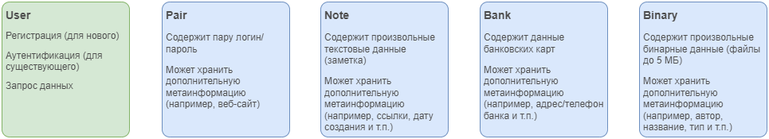
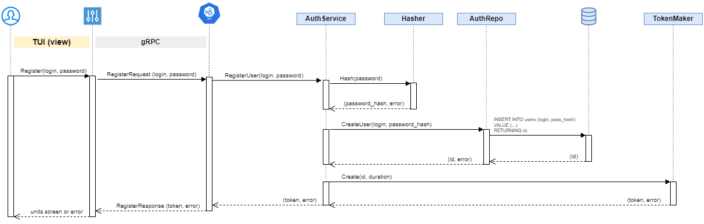
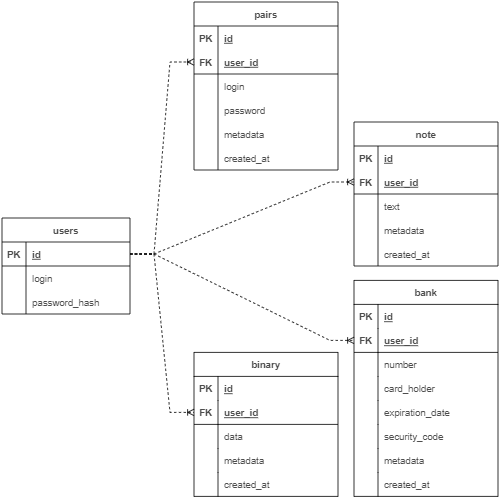
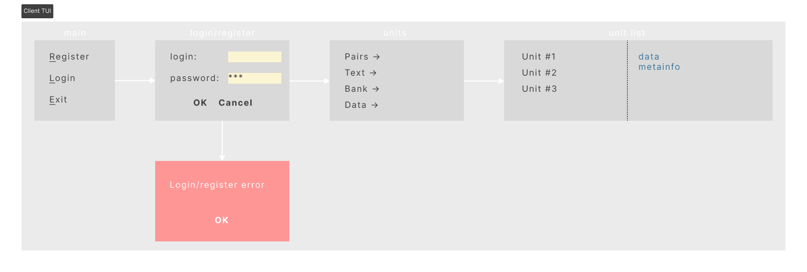

# Менеджер паролей GophKeeper

[](LICENSE)

- [Общая информация](#общая-информация)
- [Архитектура](#архитектура)
    - [Функциональная схема](#функциональная-схема)
    - [Сущности приложения](#сущности-приложения)
    - [Диаграмма последовательности](#диаграмма-последовательности)
    - [Схема базы данных](#схема-базы-данных)
- [Особенности реализации](#особенности-реализации)
    - [Сборка](#сборка)
    - [Конфигурация](#конфигурация)
    - [Терминальный интерфейс клиента](#терминальный-интерфейс-клиента)
    - [Использованные библиотеки](#использованные-библиотеки)
- [Итоги](#итоги)
    - [Освоенные темы](#освоенные-темы)
    - [Возможное развитие проекта](#возможное-развитие-проекта)

## Общая информация
[Техническое задание](docs/SPECIFICATION.md)

Клиент-серверная система хранения приватных данных «GophKeeper» (второй выпускной проект курса «Продвинутый Go-разработчик»). Обеспечивает безопасное хранение и передачу следующих данных пользователя:
- [x] пара логин/пароль
- [x] данные банковских карт
- [x] произвольные текстовые данные
- [ ] произвольные бинарные данные (файлы до 1 МБ)

Также для всех типов данных есть возможность хранения произвольной текстовой метаинформации (принадлежность данных к веб-сайту, личности или банку, списки одноразовых кодов активации и прочее).

Клиент и сервер обмениваются данными с помощью gRPC.

Клиент представляет собой CLI-приложение (с терминальным интерфейсом) с возможностью запуска на платформах Windows, Linux и Mac OS. Реализует следующий функционал:
- [x] регистрация нового пользователя
- [x] аутентификация существующего пользователя
- [ ] шифрование/расшифровка приватных данных пользователя
- [ ] создание/удаление/обновление приватных данных пользователя

Сервер обслуживает запросы от клиентской программы и реализует следующую логику:
- [x] обслуживание запроса на регистрацию
- [x] аутентификация пользователя
- [ ] обслуживание запросов на создание/обновление/удаление приватных данных пользователя
- [x] работа с базой данных

Пароли пользователей храняться в БД в зашифрованном виде (для шифрования используется bcrypt).

Для аутентификации запросов пользователя, используются токены PaseTo. Токен генерируется при регистрации/аутентификации пользователя и отправляется со всеми командами (кроме register/login).

## Архитектура
### Функциональная схема


### Сущности приложения


### Диаграмма последовательности
Представлена на примере маршрута первичной регистрации пользователя.


### Схема базы данных
В качестве базы данных используется PostgreSQL.



## Особенности реализации
### Сборка
Для сборки клиента и сервера можно использовать следующие команды (прописаны в `Makefile`):
```make
make client_build
```
```make
make server_build
```
Либо аналоги (выполняются из корня проекта):
```bash
cd ./cmd/client
GOARCH=amd64 GOOS=linux go build -o ${CLIENT_BINARY_NAME}-linux main.go
GOARCH=amd64 GOOS=windows go build -o ${CLIENT_BINARY_NAME}-windows main.go
GOARCH=amd64 GOOS=darwin go build -o ${CLIENT_BINARY_NAME}-darwin main.go
```
```bash
cd ./cmd/server
GOARCH=amd64 GOOS=linux go build -o ${SERVER_BINARY_NAME}-linux main.go
GOARCH=amd64 GOOS=windows go build -o ${SERVER_BINARY_NAME}-windows main.go
GOARCH=amd64 GOOS=darwin go build -o ${SERVER_BINARY_NAME}-darwin main.go
```


### Конфигурация
Клиентское и серверное приложения конфигурируются переменными окружения или данными из файла конфигурации (путь к которому задаётся флагом `-c` при запуске). Приоритет отдаётся переменным окружения.

Если параметр не задан ни в одном из вариантов, то при запуске будет выдана ошибка и приложение завершится с кодом `1`.

**Клиент**

| Переменная окружения | Параметры из файла | Описание                              |
|----------------------|--------------------|---------------------------------------|
| `APP_NAME`           | `app.name`         | название приложения                   |
| `APP_VERSION`        | `app.version`      | версия приложения                     |
| `GRPC_ADDRESS`       | `grpc.address`     | адрес gRPC-сервера                    |
| `GRPC_PORT`          | `grpc.port`        | порт gRPC-сервера для отправки команд |

**Сервер**

| Переменная окружения    | Параметры из файла       | Описание                                     |
|-------------------------|--------------------------|----------------------------------------------|
| `APP_NAME`              | `app.name`               | название приложения                          |
| `APP_VERSION`           | `app.version`            | версия приложения                            |
| `PG_URL`                | *нет*                    | адрес подключения к базе данных              |
| `PG_POOL_MAX`           | `postgres.pool_max`      | максимальное количество подключений к БД     |
| `PG_CONN_ATTEMPTS`      | `postgres.conn_attempts` | количество попыток подключения к БД          |
| `GRPC_PORT`             | `grpc.port`              | порт приёма команд и отправки данных по gRPC |
| `TOKEN_KEY`             | *нет*                    | ключ для подписи токена                      |
| `TOKEN_ACCESS_DURATION` | `token.access_duration`  | длительность действия токена                 |

### Терминальный интерфейс клиента
После успешного запуска клиента в терминале появляется основное меню (main), из которого можно зарегистрировать нового пользователя либо зайти с имеющимся логином/паролем.

После успешного входа (получение токена от сервера) отображается меню с типами данных (`units` на изображении ниже), хранящихся на сервере. Из него можно перейти к просмотру необходимых списков.

Также в нижней части слева отображается версия приложения клиента.

Навигация по меню осуществляется стрелками `вверх/вниз`, выбор пункта - клавиша `Enter`. Также слева от пунктов имеются указания клавиш быстрого доступа - нажатие соответствующей клавиши приведёт к немедленному переходу к соответствующему экрану/меню.



### Использованные библиотеки
- Конфигурация: [ilyakaznacheev/cleanenv](https://github.com/ilyakaznacheev/cleanenv)
- Логгирование: обёртка над [uber-go/zap](https://github.com/uber-go/zap)
- Работа с БД: драйвер [jackc/pgx](https://github.com/jackc/pgx), библиотека [jmoiron/sqlx](https://github.com/jmoiron/sqlx)
- Авторизация: [o1egl/paseto](https://github.com/o1egl/paseto)
- Тестирование: [stretchr/testify](https://github.com/stretchr/testify)
- Интерфейс клиента (TUI): [rivo/tview](https://github.com/rivo/tview)

## Итоги
### Освоенные темы
**Анализ ТЗ**

Получил полезный опыт формулирования технических требований и построения структуры приложений на основе текстового описания пожеланий к системе ([ТЗ](docs/SPECIFICATION.md)).

**Архитектура и организация приложения**

Скомпоновал подходы, которые использовал для учебного проекта (DevOps трек) и первого выпускного (gophermart).

Понравилось применение подхода "Чистой архитектуры" - приложение получается достаточно гибким для внесения изменений в будущем.

**Обмен по gRPC**

Намеренно выбрал реализацию через gRPC, чтобы закрепить знания полученные в последнем спринте.

**Тестирование**

Для изучения подхода TDD применил его при выполнении данного проекта. Поначалу было очень трудозатратно по времени, т.к. непривычно. Потом втянулся и стало получаться быстрее. Подход понравился - написание теста перед кодом получается как некий этап проектирования (а в какой-то степени и документирования) и помогает понять что хочешь от будущего функционала. Намерен изучать и применять в дальнейшем.

Также лучше разобрался с mock-тестированием.

**Code-style и выразительность**

Старался использовать комментарии для функций, интерфейсов и структур всех импортируемых пакетов, а также, при необходимости, внутренних функций данных пакетов.

Для лучшего изучения и соблюдения code-style локально установил `gofumpt` и `golangci` (команда запуска прописана в `Makefile`).

Также настроил проверку посредством `golangci` в Github Actions при каждом `git push`.

**Новые библиотеки**

Для построения клиентского интерфейса использован пакет [rivo/tview](https://github.com/rivo/tview). Хорошо документирован (с отдельными примерами для каждого элемента), прост и понятен в применении.

Как возможный вариант рассматривал - [charmbracelet/bubbletea](https://github.com/charmbracelet/bubbletea).

### Возможное развитие проекта

- [ ] Шифрование пользовательских данных с помощью ключей (private-public key).
- [ ] Подгрузка на клиентское приложение только изменившихся данных (например, путём проверки md5-хеша из базы)
- [ ] Хранение токена и вход без ввода пароля пока токен валиден
- [ ] Больше информативности в TUI (ошибки от сервера и клиента)
- [ ] Необходимость изменять пароль (например, через 1/3/6 месяцев). Неповторяемость паролей.
- [ ] Разбить код отвечающий за TUI на логические части (для более удобного восприятия).
- [ ] Отображение версии сервера в TUI при подключении
